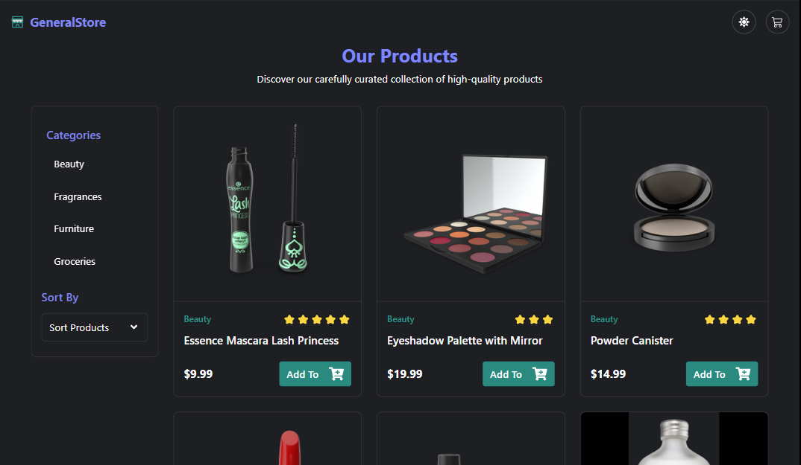

# Shopping Cart App TypeScript

Una aplicación de carrito de compras moderna construida con React, TypeScript y Tailwind CSS.


## 🖼️ Vista Previa



### 🔗 Demo en vivo

[Ver Demo](https://shopping-cart-app.vercel.app) - Prueba la aplicación en funcionamiento

## 📋 Características

- **Gestión del carrito de compras**: Añadir, eliminar, incrementar y decrementar productos
- **Filtrado de productos**: Filtros por categoría y otras propiedades
- **Tema claro/oscuro**: Soporte completo para modo oscuro
- **Interfaz moderna**: Diseño responsivo y minimalista
- **Componentes reutilizables**: Dropdown, botones, tarjetas y más
- **Código totalmente tipado**: Escrito en TypeScript para mayor robustez

## 🚀 Tecnologías

- **React 19**: Biblioteca UI moderna con hooks
- **TypeScript**: Soporte de tipos estático
- **Tailwind CSS 4**: Framework de CSS utility-first
- **Context API + Reducers**: Gestión del estado de la aplicación
- **Vite**: Empaquetador de aplicaciones rápido
- **React Icons**: Iconos de alta calidad

## 🛠️ Estructura del proyecto

```
src/
├── components/       # Componentes de la interfaz
│   ├── header/       # Componentes del encabezado (Header, CartButton, etc.)
│   ├── main/         # Componentes principales (productos, filtros, etc.)
│   ├── footer/       # Componentes del pie de página
│   └── ui/           # Componentes reutilizables (Dropdown, Button, etc.)
├── context/          # Contextos de React
│   ├── cart/         # Contexto del carrito de compras
│   └── filter/       # Contexto para filtrado de productos
├── reducers/         # Reducers para gestión del estado
├── types/            # Definiciones de tipos TypeScript
├── hooks/            # Hooks personalizados
├── utils/            # Funciones utilitarias
└── mocks/            # Datos de ejemplo
```

## 🏁 Comenzando

### Prerrequisitos

- Node.js (v18 o superior)
- pnpm (recomendado) o npm

### Instalación

1. Clona el repositorio

   ```bash
   git clone https://github.com/tu-usuario/shopping-cart-app.git
   cd shopping-cart-app
   ```

2. Instala las dependencias

   ```bash
   pnpm install
   # o
   npm install
   ```

3. Inicia el servidor de desarrollo

   ```bash
   pnpm dev
   # o
   npm run dev
   ```

4. Abre `http://localhost:5173` en tu navegador

## 📱 Uso

### Añadir productos al carrito

- Haz clic en el botón "Añadir al carrito" en cualquier producto para agregarlo
- Si el producto ya está en el carrito, su cantidad se incrementará

### Gestionar el carrito

- Haz clic en el icono del carrito en la parte superior para ver su contenido
- Usa los botones "+" y "-" para ajustar la cantidad
- Elimina productos con el botón de la papelera
- Limpia todo el carrito con el botón "Vaciar carrito"

### Filtrar productos

- Usa el dropdown de categorías para filtrar por tipo de producto
- Más filtros adicionales disponibles según las propiedades de los productos

## 🌈 Personalización

### Tema

- El tema claro/oscuro se cambia automáticamente según las preferencias del sistema
- Puedes activar manualmente el modo oscuro con el botón de tema en el encabezado

### Estilos

- Los estilos están basados en utilidades de Tailwind y pueden ser personalizados
- Las variables de tema se definen en `src/index.css`

## 📖 Aprendizajes y decisiones técnicas

- Uso de Context API + useReducer para la gestión del estado global
- Implementación de tema oscuro con variables CSS y clases condicionales
- Componentes UI reutilizables con props tipadas
- Optimización de rendimiento usando memoización

## 📄 Licencia

Este proyecto está bajo la Licencia MIT - mira el archivo LICENSE para detalles

## 🤝 Contribuciones

Las contribuciones son bienvenidas. Por favor, abre un issue primero para discutir qué te gustaría cambiar.

---

⌨️ con ❤️ por [Ibrahim Almeyda](https://github.com/Ibrahim-003)
